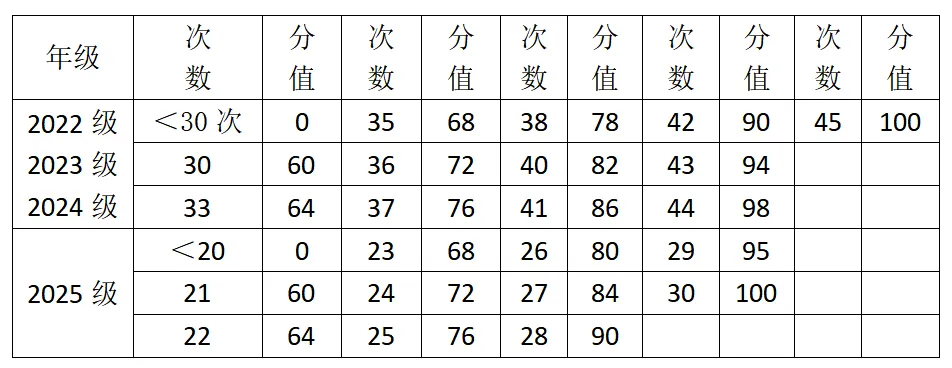

# 体测、校园跑与保健班

## 体测（体质健康测试） {#fitness-test}

为加强学校体育工作，促进学生积极参加体育锻炼，养成良好的锻炼习惯，提高学生体质健康水平，学校会在每一学年开展体测工作（每学年体测均为 1 次正测及 1 次缓测/补测）。

!!! warning "提示"
    体测若被发现有代替他人考试、让他人代替考试或其它相关违反考试纪律等情况，按照 [《福建师范大学学生纪律处分规定（修订）》（闽师学工(2017) 36 号）](https://stu.fjnu.edu.cn/31/98/c6022a143768/page.htm) 第二十三条规定执行处理。

    > 《福建师范大学学生纪律处分规定（修订）》（闽师学工(2017) 36 号）第二十三条规定  
    > 考试违纪、作弊，给予下列处分：  
    > （一）违反考试纪律尚未构成作弊的，视其认识态度，给予严重警告或记过处分。  
    > （二）考试作弊的，给予留校察看以上处分。  
    > （三）代替他人或让他人代替自己参加考试、组织作弊、使用专用设备或器材作弊、向他人出售考试试题或答案牟取利益，以及其他严重作弊或扰乱考试秩序行为的，可给予开除学籍处分。

### 体测时间 {#test-time}

体测正测在每学年的 10\~11 月之间分批次进行，缓测/补测工作则在次年 3 月左右进行。

### 体测方式 {#test-method}

在体测安排前，大体部会在 [体育科学学院官网](https://tky.fjnu.edu.cn/tzjk/list.htm) 公告关于体测的通知（相关通知同时会通过各班级体委下发）。根据通知中的附件在规定时间内到指定地点完成测试即可。体测中的项目并不严格要求顺序（甚至也并不严格要求时间），在体测工作时间内把所有项目都测过一次就可以。自 2024-2025 学年起，我校体测所有项目均采用刷身份证、机器计算的方式。

!!! tip "提示"
    - 退役复学学生、[保健班](#health-class)学生无需参加体测，体测成绩记为免测（不纳入加权计算、不影响评优评先），但需要提交免测申请。相关学生在缓测、补测工作时会被列入补测名单，但是无需参与。
    - 体育专业学生不参加统一体测，不会出现在体测正测、缓补测名单中。
    - 港澳台生、外籍生无需参加体测，不会出现在体测正测、缓补测名单中。

测试地点：

- 旗山校区：体训馆室内田径场、南区田径场（仅 1000 米）
- 仓山校区：体育馆、田径场（仅 1000 米）

### 缓测、免测申请 {#test-waiver-application}

若因伤、病、出校实习或交流学习的，可提交缓测申请。无法在正测期限内参加体测的，应当申请缓测；无法参加体测的，应当申请免测。若在正测缓测后依然无法在缓测期限内参加体测的，应当申请免测。

缓测、免测的申请流程会在体测相关通知中一并下发，自行留意即可。

2024-2025 学年起，[保健班](#health-class)学生同样需要提交免测申请。

### 缓测/补测 {#test-makeup}

体测正测成绩未达到 60 分的 或 有办理缓测的同学需要参加 缓测/补测，相关工作会在次年 3 月进行，流程与体测正测相同。

缓测/补测时可以自由选择测试项目，但需要保证最终所有项目至少有测试过一次。体测各项目最终成绩取两次测试中较高的一次。

!!! tip "提示"
    若因体测正测成绩未达到 60 分而被列入补测名单，只要所有项目都至少有测试过一次（即使是 0 分），就可以不去参加补测。

### 体测成绩 {#test-score}

#### 分数构成 {#score-components}

体测的满分为 100 分，其中后 2 个项目在超过满分后分别有 10 分的附加分，即最高分为 120 分。分数在计算及格、奖学金评定等工作时精确到小数点后 1 位，不四舍五入。

男生各项目的分数占比如下：

| 身高体重(BMI) | 肺活量 | 50 米跑 | 坐位体前屈 | 立定跳远 | 引体向上 | 1000 米跑 |
| --- | --- | --- | --- | --- | --- | --- |
| 15 分 | 15 分 | 20 分 | 10 分 | 10 分 | 10 分 | 20 分 |

女生各项目的分数占比如下：

| 身高体重(BMI) | 肺活量 | 50 米跑 | 坐位体前屈 | 立定跳远 | 1 分钟仰卧起坐 | 800 米跑 |
| --- | --- | --- | --- | --- | --- | --- |
| 15 分 | 15 分 | 20 分 | 10 分 | 10 分 | 10 分 | 20 分 |

各项目评分细则请 [点击查看](https://tky.fjnu.edu.cn/21/51/c10998a205137/page.htm)，该标准为全国通用标准。

#### 成绩下发时间 {#score-release}

体测成绩在测试时不会告知（但可以在测试完毕后的极短时间内自行查看教师屏幕上的数据，50 米、1000 米等部分项目受物理条件限制需要有人帮你查看或无法查看），会在 **缓测、补测工作前约 1 周** 和 **下一学年初** 分别下发一次，通过各班级体委下发（但实际上任何一个体委都能查询到全校的体测成绩）。

#### 体测关联 {#score-usage}

- 体测成绩与奖学金挂钩，当年 80.0 分及以上（良好及以上）才能评一等奖学金，当年 60.0 分以上（及格及以上）才能评三等及以上奖学金。
- 毕业前至少需要有四次体测成绩记录（含免测）。
- 毕业时会根据四年体测的加权平均分（其它年份体测成绩总和/3\*0.5 + 毕业年份体测成绩\*0.5）生成 **毕业成绩**，毕业成绩需要达到 50.0 分及以上才准许毕业。
- 若有免测学年，则申请免测学年的体测成绩不计入毕业成绩。此处给出一些样例：

    | 情况 | 毕业成绩公式 |
    | --- | --- |
    | 大一免测，其它学年正常参加 | 大二、大三体测成绩总和/2\*0.5 + 毕业年份体测成绩\*0.5 |
    | 大四免测，其它学年正常参加 | 大一、大二、大三体测成绩总和/3 |
    | 大一、大二、大三免测，大四正常参加 | 大四体测成绩 |
    | 四年均免测 | 无成绩，计为免测 |

## 保健班 {#health-class}

保健班指代的是【调适体育】课程，和正常的体育课程等同。上课时间与正常体育课分开，一般在星期三下午（即学校公休）。

### 面向对象 {#class-target}

身体有疾病（腰间盘突出、骨折、心脏病等）而无法正常修读体育课的同学可以申请保健班。

### 保健班申请方式 {#class-application}

- 每年进行统一体检时有保健班快速申请渠道，可以同时递交疾病相关材料申请保健班。
- 其它时间持医院就诊病例等文件到校医院开具证明，之后交体育科学学院付雯老师处。

### 保健班特点 {#class-features}

- 办理保健班时，会根据你的实际情况判断你在保健班就读的时间（1 学期 -2 年）。
- 保健班无需进行体育选课，由体科院直接分配【调适体育】课程，与正常体育课的上课时间有区别。
- 保健班不用参加每年的体测（但需要提交免测申请），体测成绩以免测计入，不影响评优评先。
- 保健班学生的【调适体育】课程成绩不超过 90 分。
- 保健班学生不要求校园跑。
- 保健班的上课内容一般为普拉提、八段锦等，每年的分数构成不同，一般有以下几个项目作为合格考：十六分钟走、坐位体前屈、深蹲、单脚站立、百次拍击。
- 保健班的课程考核内容可以根据你的身体状况、损伤部位进行相应的动作替换。向老师直接提出即可。

### 退出保健班 {#class-withdrawal}

在工作时间前往体育科学学院楼 410 办公室找体科院教学秘书即可。退出保健班时，可以自行选择新的体育课（当然要与同专业正常学生的上课校区、上课时间相同），需要自行联系自己的新老师。

## 校园跑（步道乐跑） {#campus-running}

步道乐跑为本校《大学体育》课程的考核形式之一，在大学体育（一）\~（四）中占比为 20 分，在大学体育（五）\~（八）中占比为 100 分（选择线上课程的除外）。全校非体育专业本科学生均需参与校园跑（参加调适体育课程学习的学生除外）。

### 允许的跑区 {#running-zones}

- 旗山校区西区田径场
- 旗山校区南区田径场
- 仓山校区长安山田径场
- 仓山校区小操场

### 使用的 APP {#running-app}

步道乐跑。[点击下载](https://sj.qq.com/appdetail/com.lptiyu.tanke)

注意：若使用的是安卓系统且未开启无障碍权限（非常不建议开启！），跑步过程需要全程亮屏，否则 APP 无法获取到定位。

### 单次有效跑步要求 {#running-requirements}

- 一天只计算 1 次有效跑步次数。超过 1 次有效跑步次数的，只计为 1 次（无法顺延到次日）。
- 跑步开始时间需要在 **6:00-20:00** 之间。

!!! tip "提示"
    根据学校工作安排，学校将于 2025年9月13日 - 9月26日开展新生军训工作，期间的“校园健康跑”具体时间调整为每天 **18:00-20:00**。

- 男生最低单次跑步路程要求为 2.0 km，女生最低单次跑步路程要求为 1.6 km。
- 跑步结束时，全程平均配速需要在 **3-9** min/km 之间（对于毕业年级，放宽到 3-12 min/km）。
- 对于全程路程在 3km 以内的跑步，需要在 1 小时内完成（含暂停时间）；对于全程路程在 3-10km 以内的跑步，需要在 2 小时内完成（含暂停时间）；对于全程路程在 10km 以上的跑步，不计为有效次数。
- 跑步结束时，必须经过在跑区内随机生成的 2 个打卡点。
- 跑步结束时，全程路程至少需要有 **80%** 在跑区内完成。

### 学期跑步次数及时间要求 {#semester-running-quota}

跑步次数要求每年均不相同，此处给出的次数为 2025-2026 学年第 1 学期的规定。

- 2022 级”校园健康跑”时限为 2025年9月1日 - 2026年1月4日（第 1 周 - 第 18 周），计 18 周。
- 2023 级、2024 级“校园健康跑”时限为 2025年9月1日 — 2025年12月21日（第 1 周--第 16 周），计 15 周。
- 2025 级新生“校园健康跑”时限为 2025年10月6日 — 2025年12月21日（第 6 周--第 16 周），计 10 周。

### 公共体育理论考试 {#sports-theory-test}

公共体育理论考试是大学体育（一）的分数组成部分之一，占总分中的 20 分。

#### 考试时间及方式 {#theory-test-method}

大致在第一学期期中，通过 步道乐跑 APP 线上考试，在指定的时间段内均可进行作答。每个学生有 3 次作答机会，每次要求在 1 小时内完成。

#### 考试题库 {#theory-test-tiku}

[点击进入](../tiku/sports-theory-test.md)
